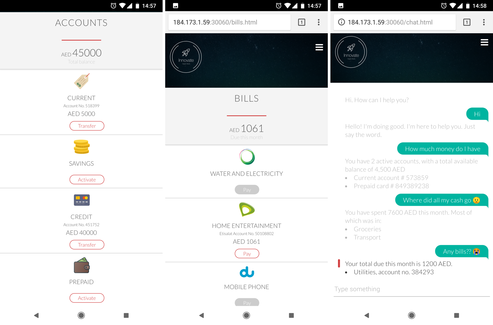

[](https://travis-ci.org/IBM/innovate-digital-bank)

# Building a Digital Bank with Node.js, Express, MongoDB, & Kubernetes

In this code pattern, we will build a dummy digital bank composed of a set of microservices that communicate with each other. We'll be using Node.js, Express, MongoDB, and the IBM Cloud Container Service.

Development of [cloud native apps](https://www.cncf.io/blog/2017/05/15/developing-cloud-native-applications/) that are broken down into a set of [microservices](http://microservices.io/) has been praised and commended as best-practice in software development methodologies. Software stacks like [Kubernetes](https://kubernetes.io/), which enable cloud native computing, have therefore picked up quite a bit of popularity.

It’s a little _(a lot)_ more fun, however, to build a so-called cloud native app, than to talk about one.

So here's our attempt:

We’ll take a use-case that has a bit of real-world familiarity to it — A digital bank. Naturally inspired by [Monzo](http://monzo.com/). Let’s call it Innovate.

[A live version deployed on a Kubernetes cluster in IBM Cloud is available for you to try here](http://ibm.biz/digibank).
To test it out, sign up for an account. A process runs periodically to dump randomized transactions and bills for user accounts, so give it a couple of minutes and refresh to see your populated profile.




## Learning objectives

When you've completed this Code Pattern, you will understand how to:

* Break an application down to a set of microservices
* Create and manage a Kubernetes cluster on IBM Cloud
* Deploy to a Kubernetes cluster on IBM Cloud
* Deploy to IBM Cloud Private

## Flow

When thinking of business capabilities, our imaginary bank will need the following set of microservices:

1. *Portal:* Loads the UI and takes care of user sessions and relies on all other microservices for core functionality.
2. *Authentication:* Handles user profile creation, as well as login & logout.
3. *Accounts:* Handles creation, management, and retrieval of a user’s banking accounts.
4. *Transactions:* Handles creation and retrieval of transactions made against users' bank accounts.
5. *Bills:* Handles creation, payment, and retrieval of bills.
6. *Support:* Handles communication with Watson Assistant to enable a support chat feature.


## Included components

* [IBM Cloud Kubernetes Service](https://console.bluemix.net/docs/containers/): IBM Cloud Kubernetes Service manages highly available apps inside Docker containers and Kubernetes clusters on the IBM Cloud.
* [Microservice Builder](https://www.ibm.com/us-en/marketplace/microclimate): Learn, build, run, and manage applications in a microservices framework.
* [Watson Assistant](https://www.ibm.com/cloud/watson-assistant/): Create a chatbot with a program that conducts a conversation via auditory or textual methods.

## Featured technologies

* [Microservices](https://developer.ibm.com/technologies/microservices/): Collection of fine-grained, loosely coupled services using a lightweight protocol to provide building blocks in modern application composition in the cloud.
* [Node.js](https://nodejs.org/): An open-source JavaScript run-time environment for executing server-side JavaScript code.
* [Containers](https://developer.ibm.com/technologies/containers/): Virtual software objects that include all the elements that an app needs to run.
* [Databases](https://developer.ibm.com/technologies/databases/): Repository for storing and managing collections of data.
* [Hybrid Cloud](https://developer.ibm.com/depmodels/hybrid/): Enabling customers to draw on the capabilities of public cloud service providers while using private cloud deployment for sensitive applications and data.

## Watch the Video

[](https://www.youtube.com/watch?v=1F1EnnMrsZ8)

## Setup

You have multiple options to setup your own instance:

* [Run it locally](#run-locally)
* [Deploy to IBM Cloud the hard way (manual, multi-stage)](#deploy-to-ibm-cloud-the-hard-way)
* [Deploy to IBM Cloud Private](#deploy-to-ibm-cloud-private)

## Run Locally

### 1. Clone the repo

Clone the `innovate-digital-bank` repository locally. In a terminal, run:

```bash
$ git clone https://github.com/IBM/innovate-digital-bank.git
```

### 2. Create an Instance of MongoDB

This code pattern depends on MongoDB as a session and data store. From the [IBM Cloud catalog](https://cloud.ibm.com/catalog), find **Compose for MongoDB** and click create. Give it a name, choose a region, pick the standard pricing plan and click create.

**Get your mongo connection string. Almost all your microservices need it; keep it safe!**


### 3. Configure your environment variables

Each of the 7 microservices must have a _**.env**_ file that stores all credentials.

An example is already provided within each folder. From the directory of each microservice, copy the example file, rename it to _**.env**_, and fill it with the appropriate values.

For example, from within the **/innovate** folder, navigate into the accounts folder

```bash
$ cd accounts
```

Next, copy and rename the _**.env.example**_ folder

```bash
$ cp .env.example .env
```

Finally, edit your **.env** folder and add your Mongodb connection string

***Repeat these steps for all microservices. In addition to your mongo URL, most will need the public IP address of your Kubernetes cluster, _You can find that under the overview of your cluster on IBM Cloud_.***

### 4. Configure your environment mode

When running the app locally without Kubernetes, the microservices do not run on the NodePorts specified in our helm chart, so we need to point our portal and userbase microservices to the correct ports.

If you're running on macOS or any linux-based system, run the following in a terminal from the git repo's directory

```bash
$ export NODE_ENV=development
```

if you're running on Windows, edit the NODE_ENV attribute in your .env file from within the **/portal** folder and the **/userbase** folder to the following:

```bash
NODE_ENV=development
```

### 5. Run

Finally, navigate to each microservice folder, and start it. Make sure you run the 7 microservice in 7 separate terminals.

```bash
$ npm start
```

You can now visit `localhost:3100` to access the portal


